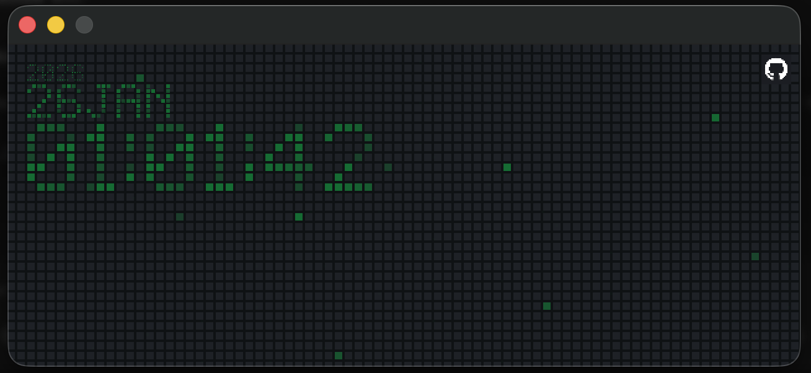

# 🇺🇦 HELP UKRAINE

We fight for democratic values, for freedom, for our future. We need your support. 
Solidarity with the Ukrainian people against the Russian invasion [Find out how you can help.](https://war.ukraine.ua/support-ukraine/).

# GitHubClock

A minimal pixel clock inspired by the GitHub contributions heatmap. Time is rendered as pixel text inside a fixed square grid, with a dark GitHub-style backdrop and configurable accent colors.


 
[⬇ Download for MacOS (beta)](./releases/githubclock.dmg)

[⬇ Download for Windows (beta)](./releases/githubclock.exe)

## Features
- Pixel-font digits rendered from 5x7 glyph maps (no text rendering).
- GitHub-style grid cells with subtle noise pixels.
- Toggle 12h / 24h time format and optional AM/PM indicator.
- Date line rendered in a smaller pixel grid.
- Theme cycling with multiple GitHub-inspired accent colors.
- GitHub integration: shows your open PRs (requires a PAT).

## Controls
- `C` Toggle theme color
- `H` Toggle 12h / 24h

## Build and Run
```bash
cargo run
```

## GitHub Token
To show your open PRs, set a classic GitHub PAT with access to your repos.

On first launch the app creates `~/.config/.githubclock` with a `GITHUB_TOKEN=` placeholder and opens it for editing. Fill in your token and save:

```env
GITHUB_TOKEN=ghp_your_token_here
```

## License

This project is open source under the [MIT License](./LICENSE). Feel free to use, modify, and distribute it as you see fit.
